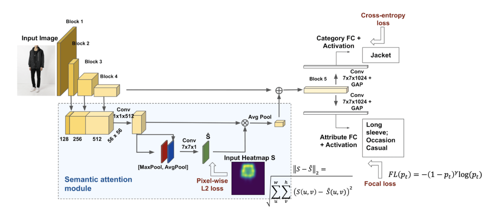

# Tag My Outfit

## Overview

This project implements a gRPC service to classify clothing parts within a set of categories, as well as predict their attributes, in a given image.

## Model Description

The prediction model is the [Visual Semantic Attention Model (VSAM)](http://openaccess.thecvf.com/content_ICCVW_2019/papers/CVFAD/Ferreira_Pose_Guided_Attention_for_Multi-Label_Fashion_Image_Classification_ICCVW_2019_paper.pdf), a compact framework with guided attention for multi-label classification in the fashion domain.
This model is supervised by automatic pose extraction creating a discriminative feature space.

The code made available through this service allows performing inference with the VSAM model pre-trained on the [DeepFashion dataset](http://mmlab.ie.cuhk.edu.hk/projects/DeepFashion.html).
The provided model weights were obtained by training VSAM on the training set and validating on the validation set of the previous dataset.



## Technologies

 * [Python](https://www.python.org)

 * [Keras](https://keras.io)
 
 * [TensorFlow](https://www.tensorflow.org)
 
 * [Scikit-learn](https://scikit-learn.org/stable/)
 
 * [SciPy](https://www.scipy.org)
 
 * [NumPy](https://numpy.org)
 
 * [gRPC](https://grpc.io)
 
 * [Docker](https://www.docker.com)
 
## Usage

The project can be deployed with docker. The [docker image](insert link here) can be obtained from [docker hub](https://hub.docker.com).
A docker-compose file is provided for an easy deployment with default configurations.

In order to achieve that, execute the following steps:

 * Install [docker](https://docs.docker.com/get-docker/) and [docker compose](https://docs.docker.com/compose/install/) by following the respective page's instructions *(Note: Docker compose might be automatically installed with docker)*

 * Download the [docker-compose](docker-compose.yml) file from the github repository

 * Start the server *(The image will be automatically downloaded)*:

```
$ docker-compose up
```

## Developers

### Requirements

 * [Python 3.6+](https://www.python.org)

 * [Python packages](requirements.txt)

### Installing

The installation steps are as follows:

 * Install [python](https://www.python.org/downloads/) by following the respective page's instructions
 
 * Clone the github repository *(Specific versions are marked by tags)*:
 
```
$ git clone https://github.com/sipg-isr/tag_my_outfit_server.git
```
 
 * Install the necessary packages by running the following command in the project's root directory:

```
$ pip install -r requirements.txt
```

 * Download the [weights file](https://drive.google.com/file/d/1QSSPlzISjjjipk1w8kPi--UJDEE7ds2Y/view?usp=sharing) and place it in the `model` folder with the name `weights.h5`

### Running

With the required software installed, we can start the server with the following command, executed in the project's root directory:

```
$ python src/server.py
```

### Testing

The project tests require the unittest package. All the following commands should be executed inside the project's root directory.

#### Unit testing

These tests do not need the server running and only verifies if key project components are functional:

```
$ python -m unittest discover -s "tests/unit/" -p "*.py"
```

#### Integration testing

These tests need the server running and will create clients to exhaustively test the server functionality:

```
$ python -m unittest discover -s "tests/integration/" -p "*.py"
```

#### Load testing

These tests also require that the server is running, and will check its performance and correctness in a load scenario by sending multiple requests simultaneously. 
Not every combination of message parameters is tested since [Integration Tests](#integration-testing) will cover all cases:

```
$ python -m unittest discover -s "tests/load/" -p "*.py"
```

## License

This project is released under the [MIT License](LICENSE.md).

## Citing

```
@Inproceedings{QuintinoFerreira2019,
  author    = {Quintino Ferreira, Beatriz and Costeira, J.P and Sousa, Ricardo G. and Gui, Liang-Yan and Gomes, João P.},
  title     = {{Pose Guided Attention for Multi-label Fashion Image Classification}},
  booktitle = {IEEE International Conference on Computer Vision (ICCV) Workshop on Computer Vision for Fashion, Art and Design},
  year      = {2019} ,
}
```
